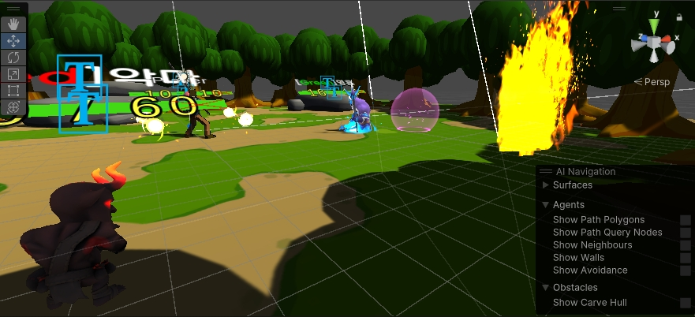
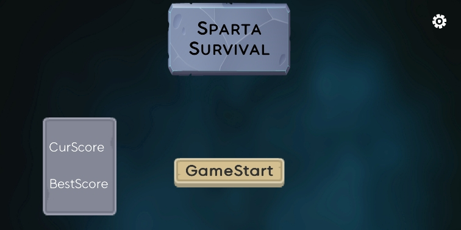
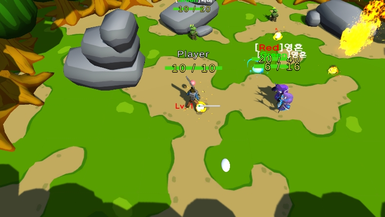
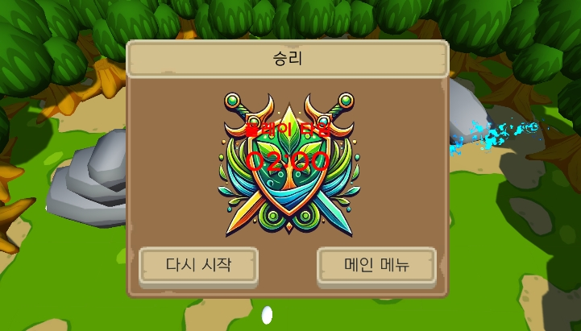

# 3D로만드는 뱀파이어 서바이벌 모작 (3DSpartaSurvival)

## 목차
1. [프로젝트 소개](#프로젝트-소개)
2. [팀원 소개](#팀원-소개)
3. [구성](#구성)
4. [주요기능](#주요기능)
5. [개발기간](#개발기간)
6. [와이어프레임](#와이어프레임)
7. [아키텍쳐](#아키텍쳐)

 

---

# 프로젝트 소개
## 프로젝트 명 : 3DSpartaSurvival
레퍼런스 게임 : [Subway Surfers]([https://namu.wiki/w/Subway%20Surfers](https://namu.wiki/w/Vampire%20Survivors))
- 이동키(WASD키, 방향키, 게임패드스틱 등)로 이동 조작만 하면 되고 공격은 자동으로 이뤄지는 탑뷰 슈터 게임. **3D 뱀서류 게임**.

 

---

# 🚀 팀원 소개

## 💻 개발팀(11조)

| 이름 (역할) | 담당 업무 | GitHub |
| :--- | :--- | :--- |
| **이형권 (팀장)** | <ul><li>보스 패턴</li><li>무기 및 아이템 데이터 구성 및 구현</li><li>전투 매커니즘 구현</li><li>리소스 매니저</li></ul> | [Github](https://github.com/example1) |
| **정진규 (팀원)** | <ul><li>UI(결과창,일시정지,아이템 획득)</li><li>아이템 획득 구현</li><li>UI 매니저 제작</li><li>UI 매니저 제작</li></ul> | [Github](https://github.com/example2) |
| **주의동 (팀원)** | <ul><li>게임 매니저 제작</li><li>일반 몬스터 패턴</li><li>플레이어 무브먼트 구현</li><li>맵 제작</li></ul> | [Github](https://github.com/example2) |

 

## 💡 기획팀(30조)

| 이름 (역할) | 담당 업무 |
| :--- | :--- |
| **김민혁 (기획)** | <ul><li>기획 담당</li></ul> |
| **정권우 (기획)** | <ul><li>기획 담당</li></ul> |

---

 

---

# 게임 구성 (Game Composition)

### **프로젝트: 3DSpartaSurvival**

`3DSpartaSurvival`은 **자동 공격**이 특징인 **탑뷰 3D 서바이벌 슈터** 게임입니다. 플레이어는 오직 이동(WASD, 방향키, 게임패드)에만 집중하며, 끊임없이 몰려오는 몬스터들을 피해 살아남고 최종 보스를 공략해야 합니다.

---

 

---

### **주요 기술 스택 (Tech Stack)**

- **적 AI 및 전투 시스템:** 유한 상태 머신(**FSM**, Finite State Machine)을 사용하여 몬스터의 행동 패턴을 구현했습니다.
- **UI 시스템:** **옵저버 패턴(Observer Pattern)**을 기반으로 `BaseUI`와 `UIManager`를 설계하여 UI 요소 간의 의존성을 줄이고 효율적인 관리를 구현했습니다.
- **데이터 관리:** **스크립터블 오브젝트(Scriptable Object)**를 활용해 아이템, 무기, 몬스터 데이터를 체계적으로 관리하였으며, `DataManager`를 통해 데이터 접근을 중앙화했습니다.
- **성능 최적화:** **오브젝트 풀링(Object Pooling)** 기법을 적용하여 몬스터, 총알 등 반복적으로 생성되는 오브젝트의 성능 부하를 최소화했습니다.

---

# 주요 기능 (Main Features)

- **간편한 조작과 자동 공격**
    - 플레이어는 WASD, 방향키, 게임패드 스틱으로 캐릭터를 **이동**시키기만 하면 됩니다.
    - 공격은 가장 가까운 적을 향해 **자동으로** 이루어져, 컨트롤의 피로감을 줄이고 생존과 회피에 집중할 수 있습니다.

- **다양한 몬스터와 보스전**
    - FSM 기반의 AI를 통해 각기 다른 행동 패턴을 가진 몬스터들이 등장합니다.
    - 스테이지의 마지막에는 강력한 **보스 몬스터**가 등장하며, 이를 처치하는 것이 게임의 핵심 목표입니다.

- **아이템 및 무기 시스템**
    - 플레이어는 몬스터를 처치하고 얻는 아이템으로 캐릭터를 강화하거나 새로운 무기를 획득할 수 있습니다.
    - 스크립터블 오브젝트를 통해 다양한 종류의 아이템과 무기를 손쉽게 추가하고 관리할 수 있습니다.

---

# 개발 기간 (Development Period)

- **총 개발 기간:** 2023.09.01 ~ 2023.09.05

---

 

---

# 와이어프레임 (Wireframe)

이 섹션에 게임의 주요 UI 와이어프레임 이미지를 추가해 주세요.

### 메인 화면

### 인게임 UI

### 게임 결과 화면

---

 

---

# 아키텍쳐
## 아키텍처 (Architecture)

본 프로젝트는 주요 기능을 관리하는 여러 **매니저(Manager)** 클래스를 중심으로 역할을 분리하여 설계되었습니다. 이를 통해 시스템 간의 결합도를 낮추고 유지보수성을 높였습니다.

### 1. 주요 매니저 및 역할

-   **`DataManager`**
    -   **역할:** 게임에 필요한 모든 정적 데이터(아이템, 무기, 몬스터 스탯 등)를 관리합니다.
    -   **작동 방식:** Scriptable Object에 정의된 데이터들을 게임 시작 시 불러와 캐싱하며, 다른 시스템이 데이터를 요청할 때 빠르고 일관된 정보를 제공합니다.

-   **`UIManager`**
    -   **역할:** 게임 내 모든 UI(체력 바, 스코어, 팝업 등)의 생성, 업데이트, 제거를 담당합니다.
    -   **작동 방식:** 옵저버 패턴을 활용하여 `Player`의 체력이나 점수 같은 데이터 변경 이벤트를 구독합니다. 데이터 변경이 감지되면 `UIManager`는 해당 UI 요소만 효율적으로 갱신하여 시스템 간의 직접적인 참조를 방지합니다.

### 2. 데이터 및 로직 흐름 : 몬스터 생성 및 전투

1.  `GameManager`가 웨이브 시작을 알리면, `MonsterSpawner`가 몬스터 생성을 시작합니다.
2.  활성화된 몬스터의 AI(FSM)는 플레이어를 탐색하고 '추적(Chase)' 상태로 전환합니다.
3.  플레이어의 자동 공격 시스템은 주기적으로 가장 가까운 몬스터를 탐지하여 총알을 발사합니다.
4.  몬스터가 총알에 맞아 체력이 0이 되면, 사망 이벤트를 발생시키고 오브젝트를 파괴합니다.

---

 

---
